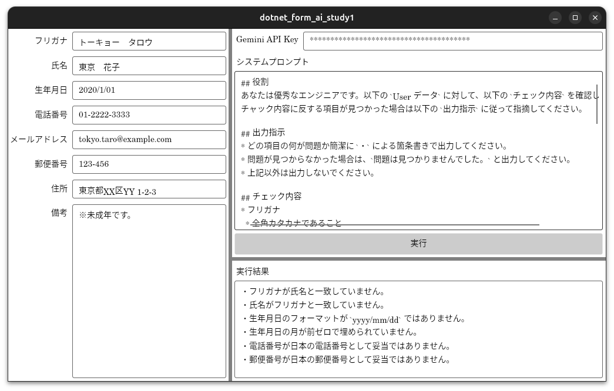

# dotnet_form_ai_study1

## 概要
* フォームの入力チェックを AI で行うコンセプトモデル
* コンセプト
  * システムプロンプトはユーザーが必要に応じて変更できる  
    → 日本語で柔軟にチェック条件を追加・変更できる（プログラミングが不要）
  * 例えば「氏名に対してフリガナが妥当か？」など、機械的には判定が難しい抽象的なチェックを行える
  * AI も間違えるが、人力よりは精度が高くコストは安い（0 か 100 かではなく、うまく良いところを活用）
  * いきなり AI に全てを任せるのではなく、AI のチェックは参考や注意喚起に留める（ダブルチェックのイメージ）



## 使い方
* 左側はよくある入力フォームのイメージ
* 右側は AI 関連で、API キーとシステムプロンプトを設定して実行すると、フォームの情報も一緒に AI に渡され、システムプロンプトに従って処理された結果が実行結果に表示される
* システムプロンプトを変更することで、柔軟にチェック条件の追加や変更を行える

## 詳細
### 留意事項
* Gemini の API キーが必要

### 構築
```
dotnet new gitignore
dotnet new console
dotnet add package NXUI.Desktop
dotnet add package Microsoft.SemanticKernel
dotnet add package Microsoft.SemanticKernel.Connectors.Google --prerelease 
dotnet add package DotNetEnv
```

### 実行
```
dotnet run
```

### ビルド
```
dotnet publish
```
